# Acta

**A verification layer for AI-era learning.**

Universities are losing the AI-detection arms race. Acta replaces detection with evidence: after every submission, students answer short concept checks generated from their own work, and every interaction is captured in a cryptographically signed ledger that defends grades on appeal and supports accreditation review.

The wedge is verification — not tutoring, not detection.

---

## Product walkthrough

The screenshots below trace one assignment end-to-end through the live demo. Run `pnpm dev:frontend` + `pnpm dev:backend` with `SEED_DEMO_DATA=true` and you'll see the same data.

### 1 — Marketing surface

The instructor-facing pitch: **Allow AI help. Verify understanding.** Four-step flow: instructor sets the rules → student submits → Acta checks understanding → instructor reviews evidence.

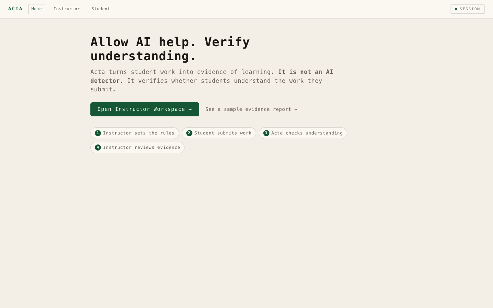

---

### 2 — Instructor creates an assignment policy

Verification mode is the hero choice — **Confidence score**, **Required gate**, or **Fail-only escalation**. Every policy versions on save, so older submissions keep the policy that scored them.

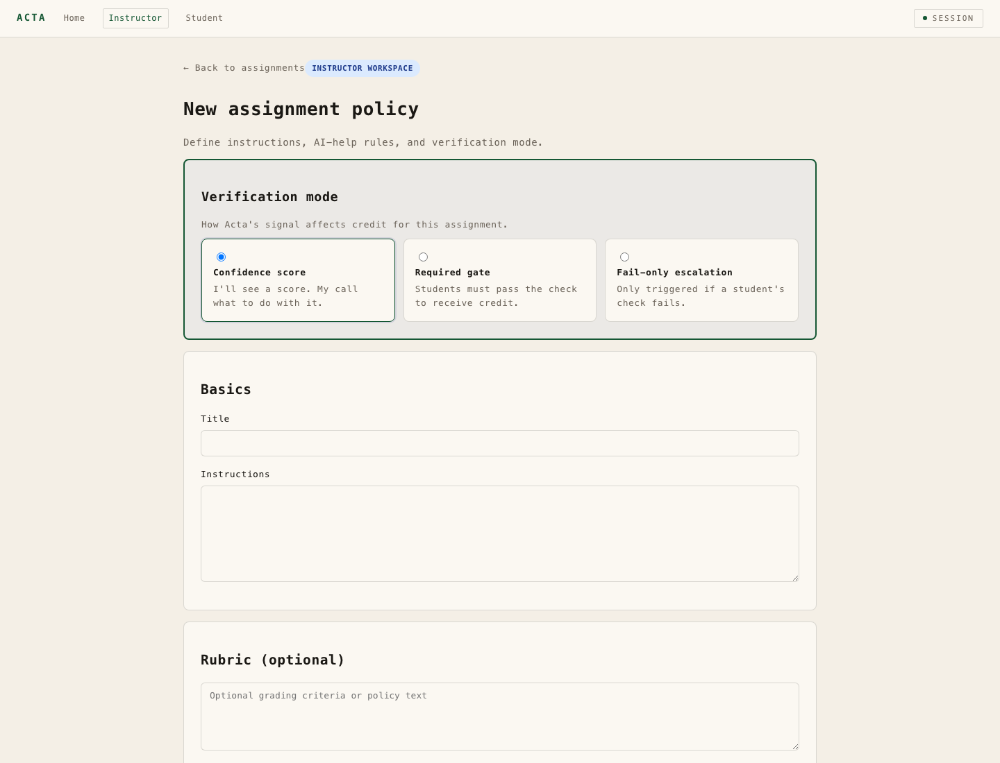

---

### 3 — Instructor edits a policy (creates a new version)

The edit form makes versioning explicit: "Saves a new version. Older submissions keep their original policy." This is how Acta keeps grading defensible months after the fact.

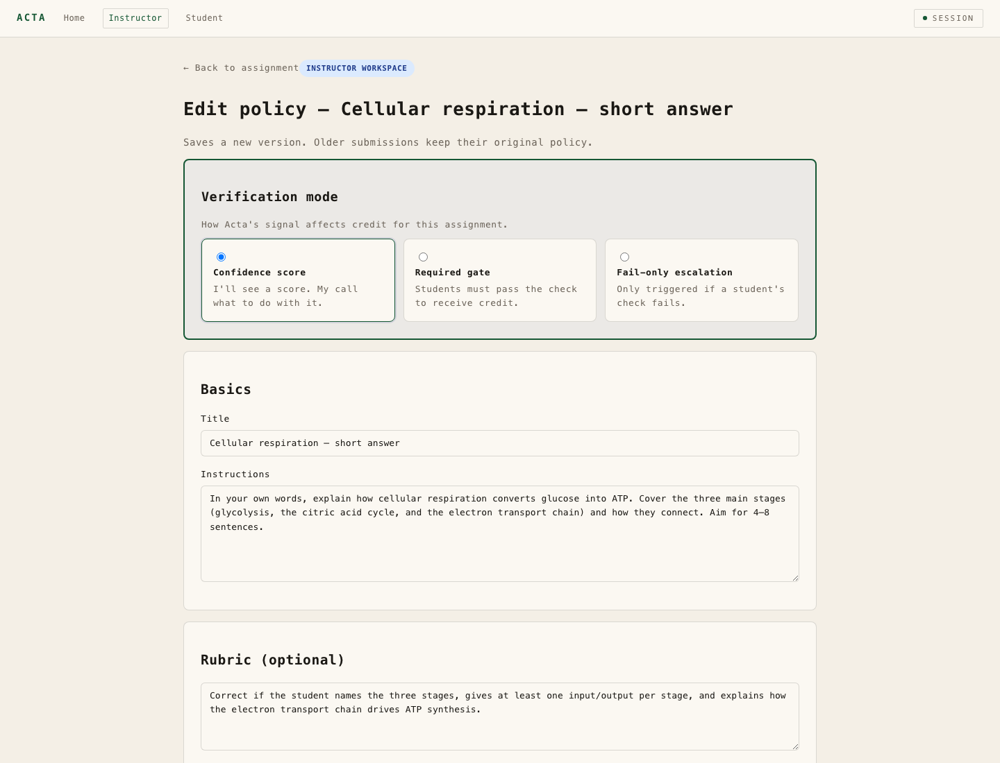

---

### 4 — Assignment detail (instructor view)

`V1 CURRENT` policy badge, `CONFIDENCE SCORE` verification badge, live status (Assignment policy: Done v1, Student AI help: Enabled, Instructor Solution Guide: Done v1, Student submissions: 1), the actual submission text, and the Instructor Solution Guide with its `referenceHash` (`4e79d584…`). Editing the Guide creates a new version — students never see Guide content.

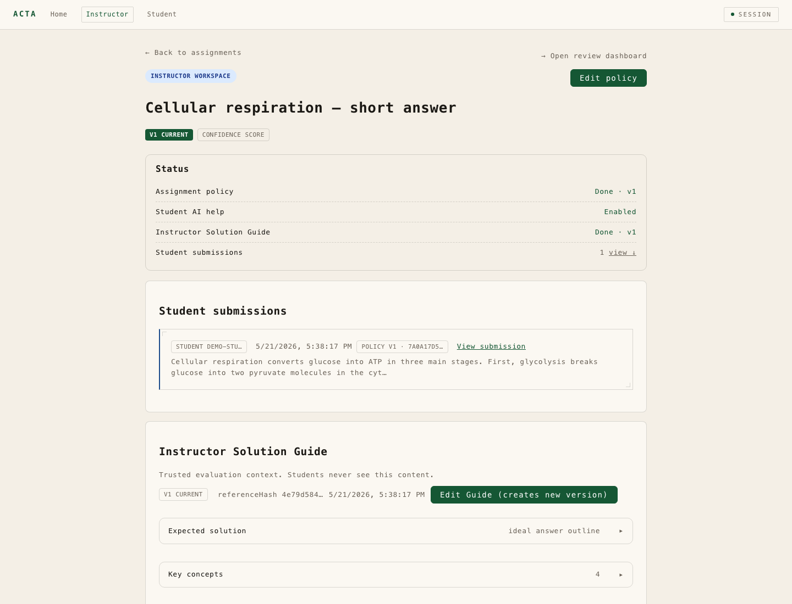

---

### 5 — Student opens the assignment

Numbered phases: **[01] Read the task** (Instructions, Rubric, AI Help Rules) and **[02] Ask for help** (the in-line Acta TA with Hint / Explanation / Example / Debugging / General modes — instructor-restricted modes are visibly disabled). `Speak replies aloud` toggle is built in.

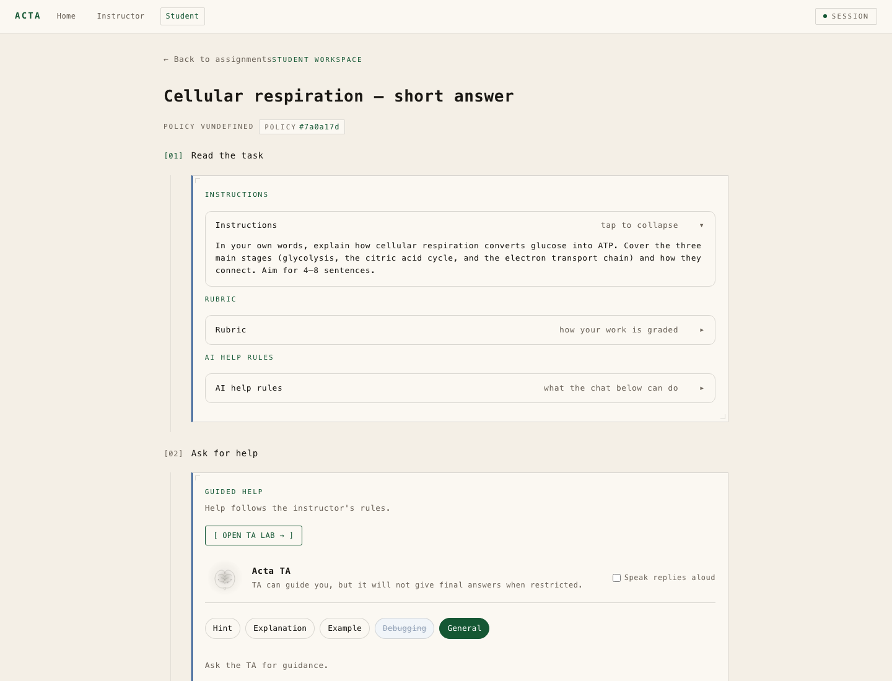

---

### 6 — TA Lab (full-screen tutoring surface)

Voice-enabled tutoring with the same instructor-policy guardrails. SESSION ACTIVE indicator, READ OFF / VOICE toggles, help-mode buttons that honor the assignment's `AI HELP RULES`. The mic input notes: *"Audio is used for transcription and is not retained by Acta."*

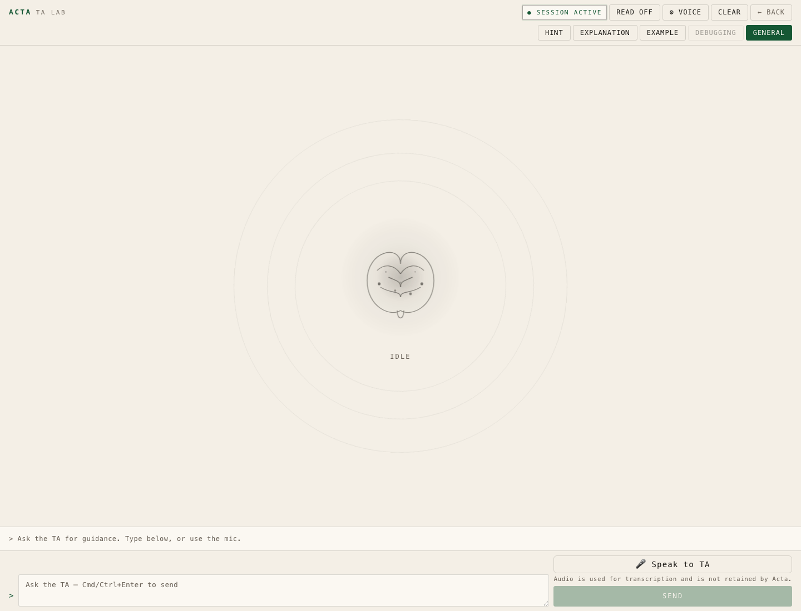

---

### 7 — Student workspace (assignment list)

Per-assignment policy badges show the verification mode, the policy hash (`#1f4d445`, `#7a0a17d`), and any restrictions (`Final answer restricted`) so students see the contract before they start.

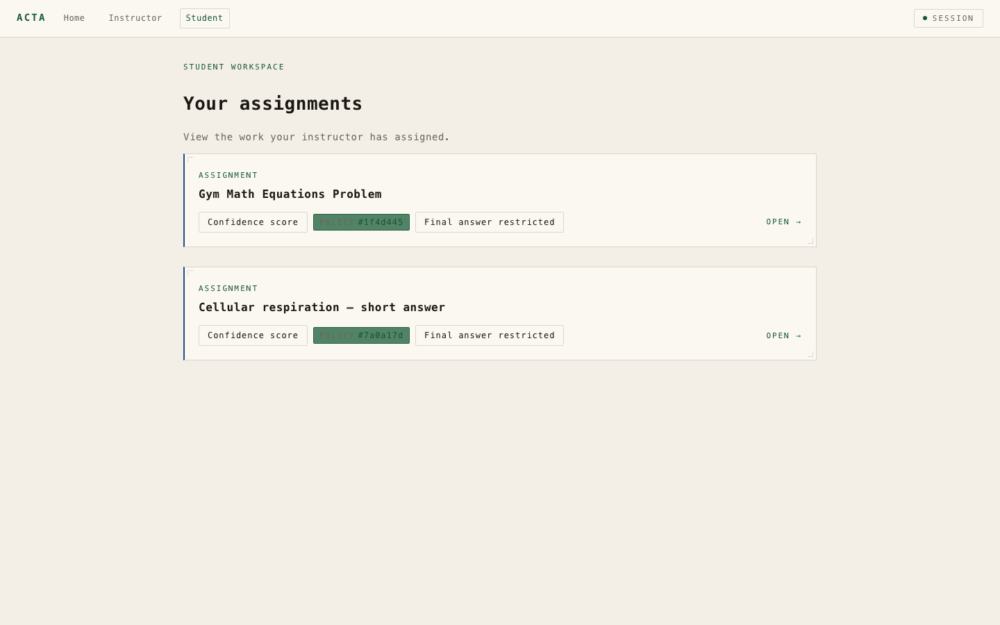

---

### 8 — Submission detail with generated concept checks

Toggle between **STUDENT VIEW** / **INSTRUCTOR VIEW**. Three concept-check questions auto-generated *from the student's own writing*, tagged with the concept under test (`[glycolysis]`, `[ATP synthase]`, `[role of oxygen]`). Verification attempts show `NEEDS REVIEW · 2 of 3 sufficient`.

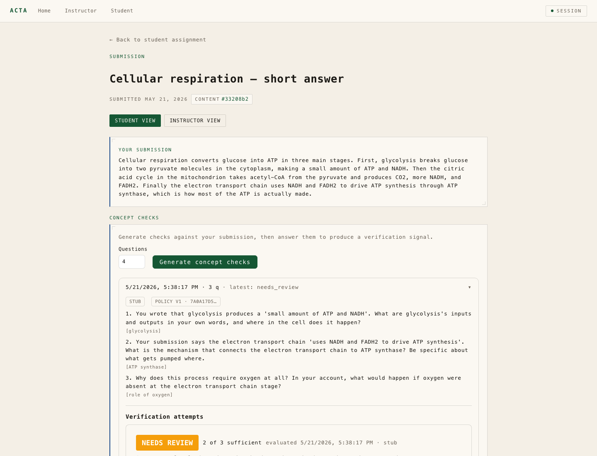

---

### 9 — Instructor review dashboard

Live metrics, outcomes (PASSED / NEEDS REVIEW / FAILED / PENDING VERIFICATION), and a "Needs attention" table with stale items first. Each row links to the full submission + the evidence report.

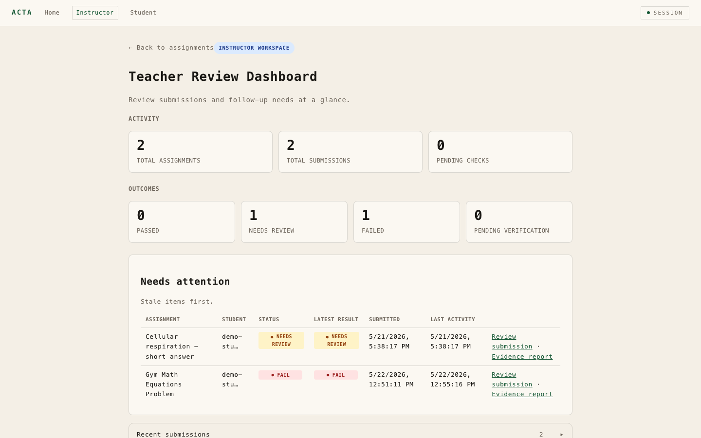

---

### 10 — Evidence-ready report (the defensible artifact)

This is what defends a contested grade. **Print/Save as PDF** built in. Captures the policy version ID, policy hash, verification mode, full AI Help Rules snapshot (Hints: Allowed · Debugging guidance: Not allowed · **Restrict final answer: Enabled HARD RULE**), instructions, rubric, and the verification outcome. Months later, an instructor can hand this to a dean or an accreditor.

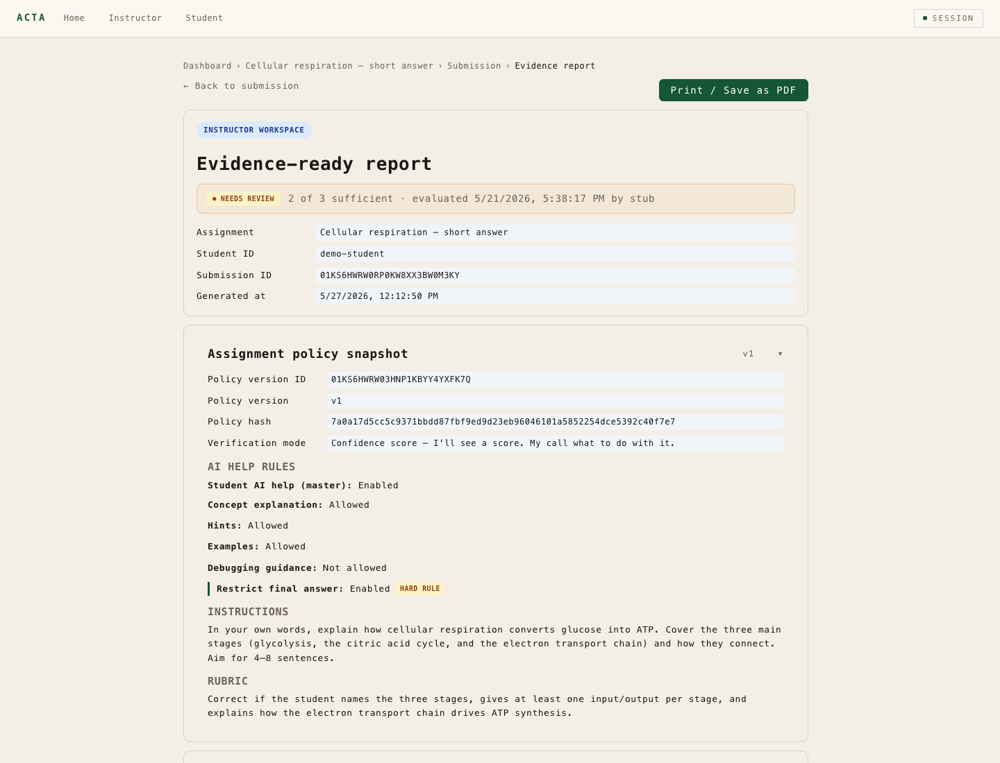

---

### 11 — Hash-pinned provenance

Every `assignment_policy_versions` row, `submissions` row, and `assignment_reference_solutions` row carries a hash today. The full signed ledger ships next.

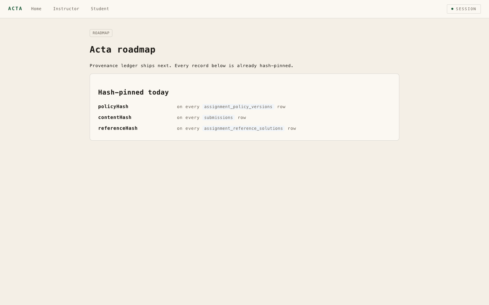

---

### 12 — FERPA-aware data handling

Plain-English explainer written for pilot conversations: synthetic-data-only today (backend refuses to boot with `ALLOW_REAL_STUDENT_DATA=true` without a signed FERPA DPA reference), per-tenant scope (cross-tenant reads return 404, asserted by defense-in-depth tests), no training on student data.

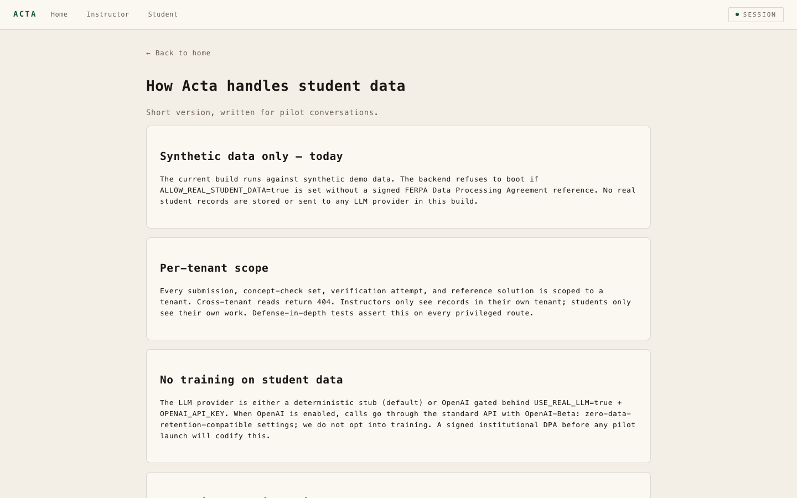

---

## What this demonstrates

- **All three verification modes** in the data model — confidence score, required gate, fail-only escalation
- **Policy versioning** — edit creates a new version; older submissions keep their original policy + hash
- **Hash-pinned provenance** on every policy version, submission, and reference solution
- **AI help policy as a hard contract** — instructor-set rules (hints / debugging / final-answer-restricted) propagate to the student's TA, the TA Lab, and the evidence report
- **Concept checks generated from the student's own writing** — tagged with the concept under test
- **Evidence reports** that capture the policy version + outcome together — printable, accreditor-ready
- **FERPA-first architecture** — synthetic-data-only guard enforced at backend boot; no real data without a signed DPA
- **Voice-enabled TA Lab** with transcription-only audio (not retained)
- **Two LLM provider paths** — deterministic stub (default) and OpenAI gated behind `USE_REAL_LLM=true` + `OPENAI_API_KEY`, with zero-data-retention settings

## Stack

- **Language:** TypeScript (strict)
- **Runtime:** Node.js 20
- **Backend:** Fastify on `:4000`
- **Frontend:** Next.js 14 on `:3000`
- **Database:** Postgres (local via Docker)
- **Package manager:** pnpm workspaces
- **Tooling:** Biome, Vitest

## Run locally

```bash
nvm use                              # picks up Node from .nvmrc
pnpm install
cp .env.example .env                 # keep ALLOW_REAL_STUDENT_DATA=false
pnpm db:up                           # local Postgres via Docker
SEED_DEMO_DATA=true pnpm dev:backend # Fastify on :4000, seeds demo tenant
pnpm dev:frontend                    # Next.js on :3000
```

Open <http://localhost:3000> for the demo flow. Walk through:

1. `/instructor` — assignment list, click into one
2. `/instructor/dashboard` — the review surface
3. `/student` — student workspace
4. `/student/<assignment-id>/ta-lab` — voice TA Lab
5. `/submissions/<submission-id>/evidence-report` — the defensible artifact

Health checks: <http://localhost:3000/healthz>, <http://localhost:4000/healthz>

## Design constraints

A handful of hard rules shape every decision in this codebase:

1. Verification is the wedge — not tutoring
2. The signed ledger ships in v1
3. All three grading modes ship in MVP
4. No AI-detection features, ever — that's the paradigm Acta replaces
5. Student data is FERPA PII at every layer
6. Any feature that adds instructor burden requires explicit approval

## Repo layout

```
src/
  backend/    # Fastify API, ledger, AI provider selection, FERPA guards, demo seeder
  frontend/   # Next.js — instructor + student workspaces, TA Lab, evidence reports
  ai/         # provider abstraction + stub/anthropic implementations
docs/         # architecture, decisions, FERPA scoping, design specs, screenshots
prompts/      # AI pipeline prompt sources
evals/        # eval harness
scripts/      # foundation checks
tests/        # foundation + defense-in-depth suite
.claude/      # multi-agent operating system (10 role-scoped agents + policy files)
```

The `.claude/` directory is a custom multi-agent system that drives this build — research, scope, design, implementation, security, and demo each run as their own specialized agent with hard constraints they cannot override.

---


